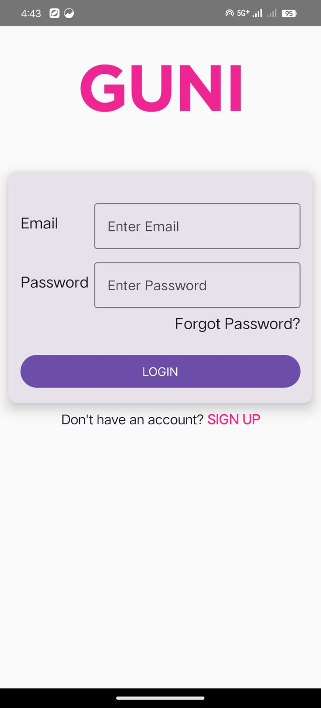
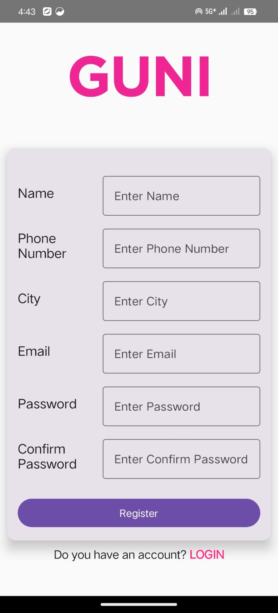

# Practical 5  

## 🎯 Aim  

Create an Android Application that includes **Login** and **Registration screens** using **Jetpack Compose**.  

---

## 📖 Description  

This practical focuses on building modern UI using **Jetpack Compose**.  
The application consists of two working screens:

### 🔐 Login Screen
- Email field  
- Password field with visibility toggle  
- Login button  
- "Don't have an account? Sign Up" navigation text  

### 📝 Registration Screen
- Name field  
- Email field  
- Password & Confirm Password fields  
- Validation for matching passwords  
- Registration button  
- "Already have an account? Login" navigation text  

Navigation between both screens is implemented using **Navigation Compose**.

---

## 📸 Screenshots with Description  

| Screenshot | Description |
|-----------|-------------|
| 
 | The **Login Screen** where the user enters email & password and navigates to Register. |
| 
 | The **Registration Screen** where the user enters personal details and creates an account. |

---

## 🛠 Technologies Used  

- **Kotlin**  
- **Jetpack Compose**  
- **Material 3 Components**  
- **Navigation Compose**  
- **State Management using remember & mutableStateOf**

---

## 🧪 Result  

The Android application was successfully developed using **Jetpack Compose**, demonstrating:  
- Login screen  
- Registration screen  
- Input validation  
- Navigation between screens  
- Material 3 Compose UI components  

---

## 📘 Student Details  

> **Name:** *Ridham Patel*  
> **Enrollment:** *23012021041*  
> **Batch:** *5IT-B-1*  

